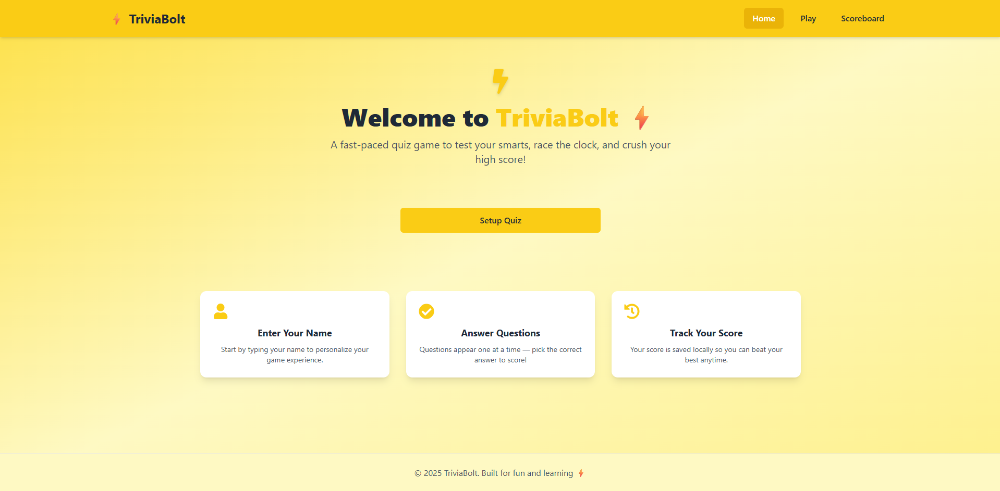

## TriviaBolt⚡ – Trivia Quiz App

**TriviaBolt** is a modern, responsive trivia quiz app built with **React**, **Redux Toolkit**, and the **Open Trivia Database API**. Users can customize quiz settings, choose categories, difficulty levels, and question types, and test their knowledge in a fun and interactive interface.

---

### 🚀 Features

* 🎨 Beautiful modern UI using **Tailwind CSS**
* 🎯 Setup page to choose:

  * Username
  * Question category
  * Difficulty (Easy / Medium / Hard)
  * Type (Multiple Choice / True-False)
  * Number of questions (1–50)
* 🧠 Fetches trivia questions from the [OpenTDB API](https://opentdb.com/)
* 🕹️ Dynamic quiz gameplay experience
* 🔁 Global state management using **Redux Toolkit**
* ⚠️ Real-time form validation and notifications with **React Toastify**

---

### 📸 Preview



---

### 🛠️ Tech Stack

* **Frontend**: React, Tailwind CSS
* **State Management**: Redux Toolkit
* **HTTP Requests**: Axios
* **Notifications**: React Toastify
* **Routing**: React Router
* **Trivia Questions API**: [OpenTDB](https://opentdb.com/)

---

### 📦 Installation

```bash
# Clone the repo
git clone https://github.com/Dev-Rodiyat/TriviaBolt.git
cd TriviaBolt

# Install dependencies
npm install

# Start the development server
npm run dev
```

The app will run at `http://localhost:5173` (or whatever your Vite/React config specifies).

---

### 🔧 Project Structure

```
src/
├── components/        # Reusable UI components (optional)
├── pages/             # Pages like Setup, Play, Results
├── redux/
│   ├── store.js       # Redux store setup
│   ├── user/          # userSlice for managing username
│   └── game/          # gameSlice for quiz settings
├── App.jsx            # Main app component with routes
├── main.jsx           # Entry point
└── index.css          # Tailwind base styles
```

---

### 🧪 API Reference

The app uses the [Open Trivia Database API](https://opentdb.com/api_config.php). Categories are fetched from:

```
https://opentdb.com/api_category.php
```

And quiz questions are fetched using query parameters like:

```
https://opentdb.com/api.php?amount=10&category=9&difficulty=easy&type=multiple
```

---

### 🙌 Contributing

If you'd like to contribute:

1. Fork the repo
2. Create a new branch: `git checkout -b feature-name`
3. Make your changes and commit: `git commit -m "Add feature"`
4. Push to the branch: `git push origin feature-name`
5. Create a pull request

---

### 👤 Author

**Rodiyat Olajide**
[GitHub](https://github.com/Dev-Rodiyat) • [X](https://x.com/Dev_Rodiyat) • [LinkedIn](https://www.linkedin.com/in/rodiyat-olajide-71b737329/)
